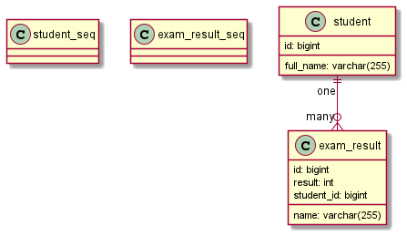

# Student/Exam Result API

## Pre-requisites

* At least Java 1.8 
* Maven https://maven.apache.org/

## Objective

Make the tests in `./src/test/java/uk/co/caci/cyp/mis/ApplicationTests.java` pass by writing the following REST API's:

* `/api/student` to return all student records
* `/api/student/{id}` to return a student record by its ID
* `/api/exam-result` to return all exam result records
* `/api/student/{id}/exam-result` to return all the exam result records for a student
* `/api/exam-result/{id}/grade` to return the grade for an exam result
* `/api/student` to create a student record

The `/api/exam-result/{id}/grade` API should return a JSON object with at least a grade property, e.g., `{"grade": "F"}`. The grade
should be calculated using the value in the `exam_result.result` column, use the table below for mapping a result to a grade.

| Result         | Grade |
|:---------------|:------|
| null           | U     |
| <60            | F     |
| \>=60 and < 80 | B     |
| \>=80          | A     |

## Architecture

A Spring Boot project with Spring Boot Starter Data JPA and Spring Boot Starter Web.

Running an in memory` H2 database. The database will be created and populated everytime
the application is started. The schema is defined in `./src/main/resources/schema.sql`, the data items are defined in
`./src/main/resources/data.sql`.

The H2 console can be accessed via `/h2-console`. The JDBC URL will be logged to the console
by Spring during startup and the entry will look something like `H2 console available at '/h2-console'. Database available at 'jdbc:h2:mem:9f512af6-45fe-45a2-9c9b-28c950fcba95'`.

Use `next value for <seq_name>`, e.g., `next value for student_seq` to get the next value from a sequence in H2.

## Database

### ERD

### Student Records

| ID | FULL\_NAME |
| :--- | :--- |
| 1 | Jane Doe |
| 2 | John Doe |

### Exam Result Records

| ID | NAME | RESULT | STUDENT\_ID |
| :--- | :--- | :--- | :--- |
| 1 | Chemistry 100 | 60 | 1 |
| 2 | Maths 200 | 55 | 1 |
| 3 | English 120 | 98 | 1 |
| 4 | English 120 | NULL | 1 |
| 5 | Chemistry 100 | 70 | 2 |

## Ideal Approach

Use Spring's JPA based repositories. 

Avoid using Hibernate directly.

Use a service class to encapsulate business logic.

Use Spring for injecting beans.

Model the student amd exam result relationship using JPA annotations.